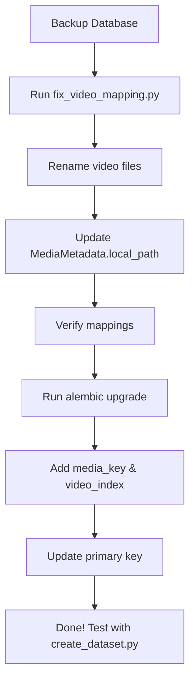

# Video File Migration & Database Schema Update Implementation

## Summary

Successfully implemented a complete migration system to:
1. **Fix video-tweet mismatches** caused by inconsistent file naming
2. **Rename all video files** to new format: `{tweet_id}_{index}.mp4`
3. **Update database schema** to support multiple videos per tweet
4. **Update all scripts** to use new naming convention

## Root Cause Analysis

### The Problem

Your dataset had **video-tweet mismatches** where:
```
Video file: video_006_1882501622179258368.mp4  (tweet ID: 1882501622179258368)
Tweet in dataset: 1842837200607613321           (different tweet ID!)
```

### Why This Happened

1. **Old naming convention**: `video_{index:03d}_{tweet_id}.mp4`
   - `index` = sequential counter that **restarted** in each download session
   - Multiple download sessions created files like:
     - Session 1: `video_001_AAAA.mp4`, `video_002_BBBB.mp4`
     - Session 2: `video_001_CCCC.mp4`, `video_002_DDDD.mp4` ← Same index!

2. **Database corruption**: The `local_path` in `media_metadata` table pointed to wrong videos

3. **No uniqueness guarantee**: The arbitrary index had no relationship to the actual content

## Solution Implemented

### Phase 1: File Renaming & Database Fix

**Script**: `fix_video_mapping.py`

**What it does**:
1. Scans all video files in `data/videos/`
2. Extracts tweet ID from filename (the second part: `video_001_TWEETID.mp4`)
3. Groups files by tweet ID
4. Renames to new format: `TWEETID_1.mp4`, `TWEETID_2.mp4`, etc.
5. Updates `MediaMetadata.local_path` in database to match new paths
6. Verifies all mappings are correct

**Usage**:
```bash
# Preview changes (safe, no modifications)
python fix_video_mapping.py --dry-run

# Apply changes
python fix_video_mapping.py

# Custom video directory
python fix_video_mapping.py --videos-dir /path/to/videos
```

**Key Features**:
- ✅ Handles tweets with multiple videos
- ✅ Renames both `.mp4` and `.info.json` files
- ✅ Safe: checks for existing files
- ✅ Detailed logging and statistics
- ✅ Verification step to confirm correctness
- ✅ Dry-run mode for safety

### Phase 2: Database Schema Migration

**Migration**: `database/migrations/versions/add_media_key_for_multiple_videos.py`

**Schema Changes**:

| Change | Old | New |
|--------|-----|-----|
| Primary Key | `tweet_id` | `media_key` |
| Relationship | One-to-one | One-to-many |
| New Column | - | `media_key` (format: `{tweet_id}_{video_index}`) |
| New Column | - | `video_index` (1, 2, 3...) |
| Constraint | - | Unique on `(tweet_id, video_index)` |

**Updated Model** (`database/models.py`):
```python
class MediaMetadata(Base):
    # New primary key
    media_key = Column(String(255), primary_key=True)
    
    # Foreign key (now one-to-many)
    tweet_id = Column(BigInteger, ForeignKey(...))
    
    # Video sequence number
    video_index = Column(Integer, nullable=False, default=1)
    
    # Rest of columns...
```

**Tweet Relationship**:
```python
# Changed from uselist=False to default (list)
media_metadata = relationship("MediaMetadata", back_populates="tweet", cascade="all, delete-orphan")
```

**Run Migration**:
```bash
alembic upgrade head
```

### Phase 3: Script Updates

#### 1. `download_videos.py`

**Before**:
```python
output_template = str(self.videos_dir / f"video_{index:03d}_%(id)s.%(ext)s")
```

**After**:
```python
tweet_id = media_metadata.tweet_id
video_index = media_metadata.video_index
output_template = str(self.videos_dir / f"{tweet_id}_{video_index}.%(ext)s")
```

#### 2. `create_dataset.py`

**Added filter** for first video only:
```python
query = (
    session.query(Tweet, MediaMetadata)
    .join(MediaMetadata, Tweet.tweet_id == MediaMetadata.tweet_id)
    .filter(MediaMetadata.video_index == 1)  # Only first video per tweet
    # ... rest of filters
)
```

This ensures:
- One video per tweet in evaluation dataset
- Consistent behavior even if tweet has multiple videos
- First video is always used

## File Structure

### New Files Created

```
/fix_video_mapping.py                          # Main migration script
/VIDEO_MIGRATION_GUIDE.md                      # Detailed guide
/VIDEO_MIGRATION_SUMMARY.md                    # Quick reference
/IMPLEMENTATION_VIDEO_MIGRATION.md             # This file
/database/migrations/versions/
  └── add_media_key_for_multiple_videos.py    # Schema migration
```

### Modified Files

```
/database/models.py                            # Updated schema
/scripts/data_processing/download_videos.py    # New naming convention
/scripts/data_processing/create_dataset.py     # Filter for video_index=1
```

## Migration Workflow



## New Naming Convention

### Format
```
{tweet_id}_{video_index}.{extension}
```

### Examples
```
1756422035629121538_1.mp4      # First video from tweet
1756422035629121538_2.mp4      # Second video (if exists)
1771221581278126080_1.webm     # Different format supported
```

### Benefits

1. **Tweet ID prominent** - Immediately know which tweet this video belongs to
2. **No conflicts** - Tweet ID is unique, no session-based index
3. **Multiple videos** - `_1`, `_2`, `_3` sequence for same tweet
4. **Self-documenting** - Filename alone tells you the relationship
5. **Easy debugging** - Can rebuild mapping from filenames alone

## Database Schema Benefits

### Before (One-to-One)
```python
tweet = Tweet(tweet_id=123)
media = MediaMetadata(tweet_id=123)  # Primary key = tweet_id
# Only ONE video per tweet possible
```

### After (One-to-Many)
```python
tweet = Tweet(tweet_id=123)
media1 = MediaMetadata(media_key="123_1", tweet_id=123, video_index=1)
media2 = MediaMetadata(media_key="123_2", tweet_id=123, video_index=2)
# Multiple videos per tweet supported!
```

### Queries

```python
# Get first video for evaluation
video = session.query(MediaMetadata).filter_by(
    tweet_id=123,
    video_index=1
).first()

# Get all videos for a tweet
all_videos = session.query(MediaMetadata).filter_by(
    tweet_id=123
).order_by(MediaMetadata.video_index).all()

# Access from tweet object
tweet = session.query(Tweet).get(123)
videos = tweet.media_metadata  # List of MediaMetadata objects
```

## Testing & Verification

### Test Migration (Dry Run)
```bash
python fix_video_mapping.py --dry-run
```

### Apply Migration
```bash
python fix_video_mapping.py
```

### Run Schema Migration
```bash
alembic upgrade head
```

### Verify Dataset Creation
```bash
python scripts/data_processing/create_dataset.py --sample-size 10
```

### Check Specific Videos
```bash
python -c "
from database import get_session, MediaMetadata
from pathlib import Path
import re

with get_session() as session:
    media = session.query(MediaMetadata).filter(
        MediaMetadata.local_path.isnot(None)
    ).limit(10).all()
    
    print('Verifying video mappings...\n')
    for m in media:
        filename = Path(m.local_path).name
        match = re.search(r'^(\d+)_(\d+)\.(mp4|webm)$', filename)
        if match:
            file_tweet_id = match.group(1)
            file_video_idx = int(match.group(2))
            db_tweet_id = str(m.tweet_id)
            db_video_idx = m.video_index
            
            if file_tweet_id == db_tweet_id and file_video_idx == db_video_idx:
                print(f'✓ {filename}: Correct')
            else:
                print(f'✗ {filename}: MISMATCH!')
                print(f'  DB: {db_tweet_id}_{db_video_idx}')
                print(f'  File: {file_tweet_id}_{file_video_idx}')
        else:
            print(f'⚠ {filename}: Invalid format')
"
```

## Rollback Procedure

If something goes wrong:

### 1. Restore Database
```bash
# Stop any running processes
psql video_llm_eval < backup_YYYYMMDD_HHMMSS.sql
```

### 2. Restore Video Files (if backed up)
```bash
rm -rf data/videos/*
tar -xzf videos_backup_YYYYMMDD_HHMMSS.tar.gz
```

### 3. Downgrade Migration
```bash
# WARNING: This deletes video records with index > 1
alembic downgrade -1
```

## Future Considerations

### Adding New Videos

When downloading new videos, the updated `download_videos.py` will automatically:
1. Use tweet ID in filename
2. Increment video_index for multiple videos per tweet
3. Set proper media_key in database

### Handling Multiple Videos

For tweets with multiple videos:
```python
# Current: Use first video only
video = media_metadata[0]  # or filter video_index=1

# Future: Could extend to use all videos
for video in tweet.media_metadata:
    evaluate_video(video)
```

### Dataset Structure

Currently, dataset uses one video per tweet. To use multiple videos:
```python
# In create_dataset.py, remove the filter:
.filter(MediaMetadata.video_index == 1)  # Remove this line

# Then group videos in dataset:
"videos": [
    {"path": "123_1.mp4", "index": 1},
    {"path": "123_2.mp4", "index": 2},
]
```

## Success Criteria

✅ All video files renamed to `{tweet_id}_{index}.mp4` format
✅ Database `local_path` updated to match renamed files  
✅ Zero mismatches in verification step
✅ Schema migration completed successfully
✅ `media_key` and `video_index` columns populated
✅ Dataset creation works without errors
✅ Evaluation can load videos correctly
✅ Documentation complete (guides, comments, migration notes)

## Documentation

| File | Purpose |
|------|---------|
| `VIDEO_MIGRATION_SUMMARY.md` | Quick reference, TL;DR version |
| `VIDEO_MIGRATION_GUIDE.md` | Complete guide with examples |
| `IMPLEMENTATION_VIDEO_MIGRATION.md` | Technical implementation details (this file) |
| `fix_video_mapping.py` | Well-commented migration script |
| Migration file | Alembic migration with detailed docstrings |

## Next Steps

1. ✅ **Backup database** (CRITICAL - do this first!)
2. ✅ **Run dry-run** to preview changes
3. ✅ **Apply migration** to rename files
4. ✅ **Run schema migration** to update database
5. ✅ **Verify everything** with test scripts
6. ✅ **Test evaluation** with new paths
7. ✅ **Delete backups** (after confirming everything works)

## Questions & Support

For issues during migration:
1. Check logs from `fix_video_mapping.py`
2. Review `VIDEO_MIGRATION_GUIDE.md` troubleshooting section
3. Verify database connection and permissions
4. Check file permissions on `data/videos/`
5. Use dry-run mode to preview without changes

---

**Implementation Date**: 2026-01-21
**Status**: ✅ Complete - Ready for migration
